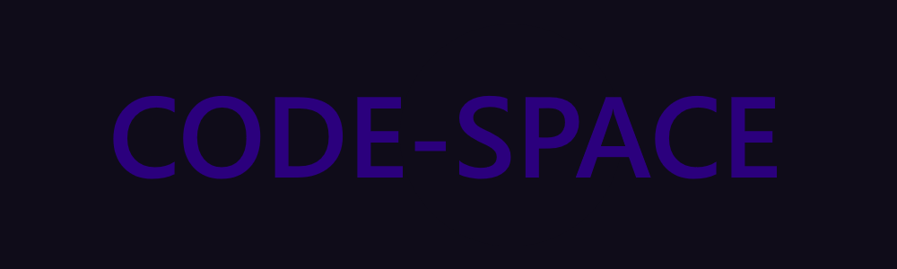

<!-- Do not provide meta name as it messes with SEO -->

# domain.sabbir.cc Documentation
Here you'll find detailed guides, the JSON file structure, and more. If you'd like to contribute to our documentation, visit [our documentation repository](https://github.com/s8rr/domain-docs) on GitHub.

## How to Register
For our Quick Start guide you can click [here](quickstart) to read it. You can also read about the domains' JSON file structure [here](useful/domain-structure).

## Guides
- [GitHub Pages](guides/github-pages)
- [Cloudflare Pages](guides/cloudflare-pages)
- [Vercel](guides/vercel)
- [Codeberg Pages](guides/codeberg-pages)
- [Netlify](guides/netlify)
- [Zoho Mail](guides/zoho-mail)
- [ImprovMX](guides/improvmx)
- [DanBot Hosting](guides/dbh)
- [Firebase Hosting](guides/firebase)
- [Hashnode Blogs](guides/hashnode)
- [Railway](guides/railway)
- [Render](guides/render)
- [Replit](guides/replit)
- [Discord Domain Verification](guides/discord-verification)
- [Bluesky Custom Handle](guides/bsky-handle)
- [Other Services](guides/other)

## Useful
 - [Domain Structure](useful/domain-structure)
 - [FAQ](useful/faq)
 - [Resources](useful/resources)

## Official Subdomains
These are the official subdomains run by the domain.sabbir.cc staff team.

- [`code-space.me`](https://code-space.me) (the root domain, used for the main page, documentation, and emails.)
- `docs.code-space.me` (this website.)

**Do *NOT* trust any websites claiming to be us that are not listed here. If you find any, please report them to [admin@domain.sabbir.cc](mailto:admin@domain.sabbir.cc).**

*We do not unsolicitedly send emails to users, do not trust any unsolicited emails claiming they are us. Report any unsolicited emails to [admin@domain.sabbir.cc](mailto:admin@domain.sabbir.cc).*